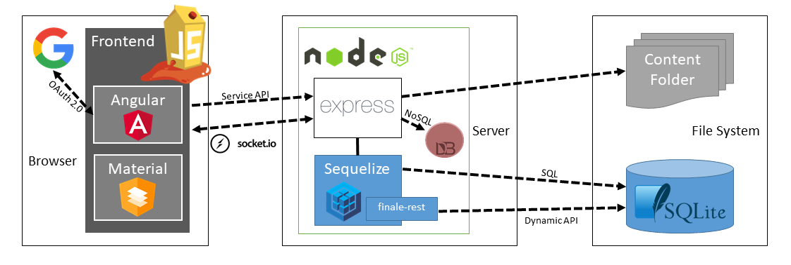
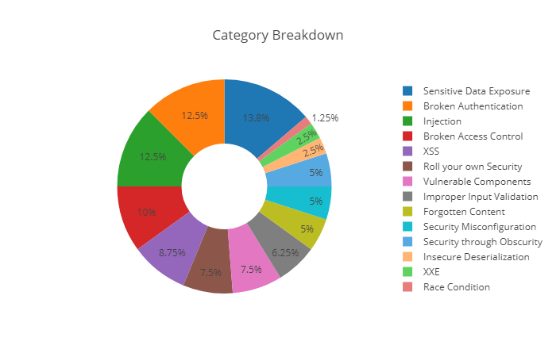

## 项目仓库

[OWASP Juice Shop](https://github.com/bkimminich/juice-shop) : Probably the most modern and sophisticated insecure web application

## 项目特色

* [使用现代 Web 开发技术](https://bkimminich.gitbooks.io/pwning-owasp-juice-shop/content/introduction/motivation.html) 开发的 `富互联网应用`（ ***Rich Internet Application, RIA*** ）或 `单页应用` （ ***Single Page Application, SPA*** ）。

* 相比较于现有的其他「DVE」项目，本项目在产品「仿真」程度上更贴近一个「真实」应用：电商系统。
* DevOps 最佳实践: Automated Build, CI/CD & Code Analysis
* 支持 `CTF` 模式运行：官方支持集成到 [CTFd](https://ctfd.io) 或 [FBCTF](https://github.com/facebook/fbctf)
* [教程完备](https://bkimminich.gitbooks.io/pwning-owasp-juice-shop/content)

## 包含漏洞类型

根据 [官方项目介绍 PPT](http://bkimminich.github.io/juice-shop/#/5) ，本项目包含超过 85 个安全挑战，包含的漏洞类型如下图：

| Category                    | OWASP                                                                                                                                      | CWE                                                                                                                                                                                                                                            |
|:----------------------------|:-------------------------------------------------------------------------------------------------------------------------------------------|:-----------------------------------------------------------------------------------------------------------------------------------------------------------------------------------------------------------------------------------------------|
| 注入 | [A1:2017](https://www.owasp.org/index.php/Top_10-2017_A1-Injection)                                                                        | [CWE-74](https://cwe.mitre.org/data/definitions/74.html)                                                                                                                                                                                       |
| 身份认证失效 | [A2:2017](https://www.owasp.org/index.php/Top_10-2017_A2-Broken_Authentication)                                                            | [CWE-287](https://cwe.mitre.org/data/definitions/287.html), [CWE-352](https://cwe.mitre.org/data/definitions/352.html)                                                                                                                         |
| 遗忘信息 | [OTG-CONFIG-004](https://www.owasp.org/index.php/Review_Old,_Backup_and_Unreferenced_Files_for_Sensitive_Information_%28OTG-CONFIG-004%29) |                                                                                                                                                                                                                                                |
| 自身安全加固 | [A10:2017](https://www.owasp.org/index.php/Top_10-2017_A10-Insufficient_Logging%26Monitoring)                                              | [CWE-326](https://cwe.mitre.org/data/definitions/326.html), [CWE-601](https://cwe.mitre.org/data/definitions/601.html)                                                                                                                         |
| 敏感数据曝光 | [A3:2017](https://www.owasp.org/index.php/Top_10-2017_A3-Sensitive_Data_Exposure)                                                          | [CWE-200](https://cwe.mitre.org/data/definitions/200.html), [CWE-327](https://cwe.mitre.org/data/definitions/327.html), [CWE-328](https://cwe.mitre.org/data/definitions/328.html), [CWE-548](https://cwe.mitre.org/data/definitions/548.html) |
| XXE | [A4:2017](https://www.owasp.org/index.php/Top_10-2017_A4-XML_External_Entities_%28XXE%29)                                                  | [CWE-611](https://cwe.mitre.org/data/definitions/611.html)                                                                                                                                                                                     |
| 输入校验不当 | [ASVS V5](https://www.owasp.org/index.php/ASVS_V5_Input_validation_and_output_encoding)                                                    | [CWE-20](https://cwe.mitre.org/data/definitions/20.html)                                                                                                                                                                                       |
| 访问控制失效 | [A5:2017](https://www.owasp.org/index.php/Top_10-2017_A5-Broken_Access_Control)                                                            | [CWE-22](https://cwe.mitre.org/data/definitions/22.html), [CWE-285](https://cwe.mitre.org/data/definitions/285.html), [CWE-639](https://cwe.mitre.org/data/definitions/639.html)                                                               |
| 安全配置缺陷 | [A6:2017](https://www.owasp.org/index.php/Top_10-2017_A6-Security_Misconfiguration)                                                        | [CWE-209](https://cwe.mitre.org/data/definitions/928.html)                                                                                                                                                                                     |
| XSS  | [A7:2017](https://www.owasp.org/index.php/Top_10-2017_A7-Cross-Site_Scripting_%28XSS%29)                                                   | [CWE-79](https://cwe.mitre.org/data/definitions/79.html)                                                                                                                                                                                       |
| 反序列化漏洞 | [A8:2017](https://www.owasp.org/index.php/Top_10-2017_A8-Insecure_Deserialization)                                                         | [CWE-502](https://cwe.mitre.org/data/definitions/502.html)                                                                                                                                                                                     |
| 缺陷组件（供应链安全） | [A9:2017](https://www.owasp.org/index.php/Top_10-2017_A9-Using_Components_with_Known_Vulnerabilities)                                      |                                                                                                                                                                                                                                                |
| 混淆不等于安全 |                                                                                                                                            | [CWE-656](https://cwe.mitre.org/data/definitions/656.html)                                                                                                                                                                                     |
| 条件竞争 | [OWASP-AT-010](https://www.owasp.org/index.php/Testing_for_Race_Conditions_%28OWASP-AT-010%29)                                                 | [CWE-362](http://cwe.mitre.org/data/definitions/362.html)                                                                                                                                                                                      |

